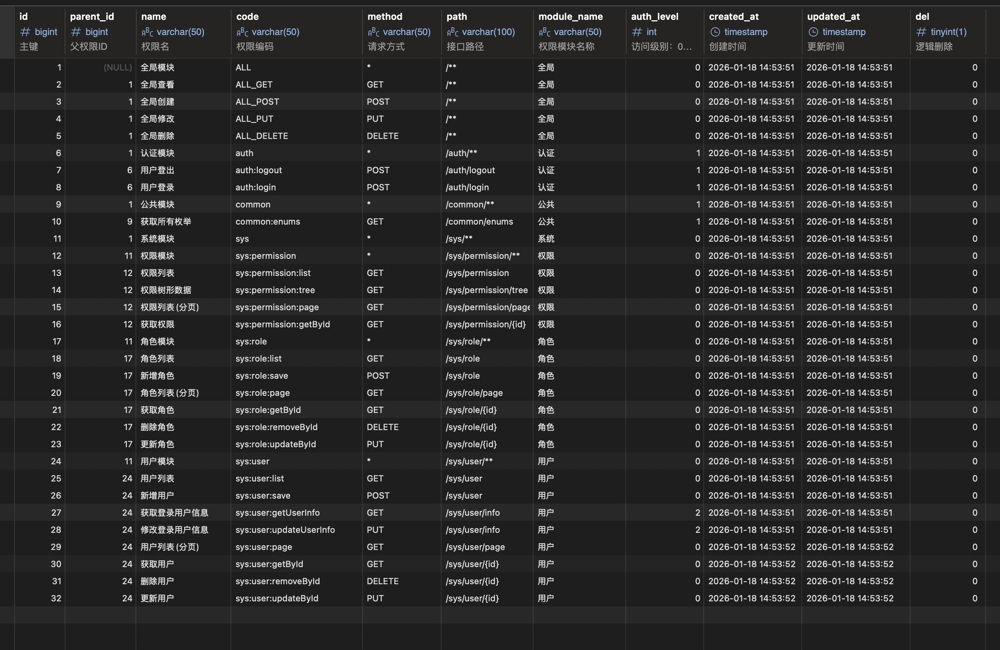

# SpringBoot + MyBatis-Plus 用户管理系统模板 📦

## 简介 💡

**这是一个基于 Spring Boot + MyBatis-Plus 的轻量级用户管理系统模板**，提供：

- 常见 CRUD / 分页封装
- 统一响应结构（ApiResponse）
- 枚举工具类
- JWT 登录鉴权
- RBAC 权限模型（支持全局 / 模块 / 接口级）
- 权限代码自动生成机制
- 代码生成器示例

适合 **后台管理系统起步**、**权限模型设计参考**、或作为公司内部基础模板。

---

## 权限设计说明 🔐

本项目采用 **后端强校验 + 前端弱控制** 的权限设计思路：

- ✅ **后端：method + path 精确鉴权（最终裁决）**
- ✅ **前端：基于 permission code 控制 UI（按钮 / 菜单）**
- ❌ 前端不参与安全判断，仅用于交互体验

---

### 1️⃣ 权限数据由代码生成（不可随意修改）

> 权限表数据由 **启动扫描器自动生成**，不允许用户手工维护，确保：
>
> - 权限与接口强一致
> - 不会出现“表里有权限，接口不存在”的情况



---

### 2️⃣ 权限校验基于 method + path

- 支持：
    - 精确匹配：`POST /sys/user`
    - 动态路径：`/sys/user/{id}`
    - 通配规则：`/**`
- 使用 `AntPathMatcher` 统一处理


---

### 3️⃣ 前端基于 permission code 做按钮级控制

- 后端登录后返回权限 code 列表


### 3️⃣ 友好的 403 体验

- 后端返回缺少的具体权限


## 🧭 菜单设计方案（无菜单表 · Code-Driven）

### 设计理念

本项目 **不使用传统的 `sys_menu` 菜单表**，也不提供后台手动维护菜单的功能。

> 菜单是前端路由的表现形式，而不是一份需要人工维护的业务数据。

传统后台（如若依）将菜单作为数据表维护，存在以下问题：

- 菜单与前端路由结构割裂
- 需要手动录入、调整，维护成本高
- 容易出现「有菜单无页面 / 有页面无菜单」
- 菜单、权限、页面三者职责混乱

因此，本项目采用 **Code-Driven Menu（代码驱动菜单）** 方案。

---

### 核心原则

- **菜单来源：前端路由**
- **权限判断：后端统一完成**
- **前端只负责展示与隐藏**
- **不在数据库中维护菜单结构**

---

### 整体架构

```text
后端
 ├─ 接口权限（method + path）
 ├─ 权限 code（如 sys:user:add）
 └─ 登录后返回当前用户拥有的 permission code 集合
            ↓
前端
 ├─ 路由配置 = 菜单定义
 ├─ 每个路由声明所需 permissionCode
 └─ 根据 permission code 过滤菜单与按钮
```

### 方案优势

- ✅ 零人工维护
- ✅ 菜单与前端路由 100% 一致
- ✅ 天然支持多端（Web / Admin / 内部系统）
- ✅ 避免冗余配置与数据不一致问题
- ✅ 更适合作为开发模板或工程基线

### 菜单不是权限的一部分，而是权限的表现层。

本项目坚持「后端管规则，前端管展示」的清晰分工。

- 权限 → 后端
- 菜单 → 前端
- 判断权 → 后端
- 显示权 → 前端

## 主要特性 ✅

- 基于 Spring Boot 3.5.5（Java 17）
- MyBatis-Plus 集成（分页、自动填充、代码生成）
- JWT 登录鉴权，Spring Security 权限控制（RBAC）
- 统一 API 响应封装（`ApiResponse`），可用 `@NoApiWrap` 跳过
- 内置代码生成器（`src/main/java/devtools/CodeGenerator.java` + Freemarker 模板）
- Swagger / OpenAPI 文档（springdoc）

---


## 技术栈与依赖分组 🔧

- **Java 17**
- **Spring Boot 3.5.5**
   - Web 支持：`spring-boot-starter-web`
   - 安全框架：`spring-boot-starter-security`、`spring-security-crypto`
- **MyBatis-Plus 3.5.5**
   - 启动器：`mybatis-plus-spring-boot3-starter`
   - 代码生成器：`mybatis-plus-generator`
- **MySQL 8.3.0**（建表 SQL 在 `init.sql`，驱动：`mysql-connector-j`）
- **JWT 认证**（`io.jsonwebtoken`）
   - `jjwt-api`（主包）、`jjwt-impl`（运行时）、`jjwt-jackson`（运行时，支持 Jackson 序列化）
- **文档与开发工具**
   - OpenAPI 文档：`springdoc-openapi-starter-webmvc-ui`
   - Lombok：`lombok`（仅开发期依赖）
   - Freemarker：`freemarker`（代码生成模板在 `src/main/resources/templates/`）

> 依赖已在 `pom.xml` 中分组并添加详细注释，便于维护和理解。
> 
> **依赖维护建议：**
> - `pom.xml` 依赖已分为 Web/REST、安全、数据库、JWT、开发工具等分组，并为每个依赖添加了中文注释。
> - 推荐后续新增依赖时，按分组和注释风格补充，保持结构清晰。
> - 依赖版本管理建议统一在 `<dependency>` 内指定，便于升级和排查。
> - 如需了解依赖分组和注释示例，请直接参考 `pom.xml` 文件。

---

## 目录结构（关键文件）


## 项目结构 🗂️

```text
.
├─ src
│  ├─ main
│  │  ├─ java
│  │  │  └─ com/github/zxs1994/java_template
│  │  │     ├─ Application.java              # 🚀 应用启动入口
│  │  │
│  │  │     ├─ cache/                         # 🔥 权限 / 系统级缓存（SysPermissionCache 等）
│  │  │
│  │  │     ├─ common/                        # 🌐 通用基础模块
│  │  │
│  │  │     ├─ config/                        # ⚙️ 系统配置
│  │  │     │  ├─ mybatisplus/                # MyBatis-Plus 配置
│  │  │     │  ├─ security/                   # Spring Security 配置
│  │  │     │  │  └─ jwt/                     # JWT 认证与过滤器
│  │  │     │  └─ swagger/                    # Swagger / OpenAPI
│  │  │
│  │  │     ├─ controller/                    # 🎯 REST API 控制器
│  │  │
│  │  │     ├─ dto/                           # 📦 请求参数 DTO（LoginDto 等）
│  │  │
│  │  │     ├─ entity/                        # 🧩 数据库实体（SysUser / SysRole / SysPermission）
│  │  │
│  │  │     ├─ enums/                         # 📘 枚举定义（状态 / 类型 / 权限级别）
│  │  │
│  │  │     ├─ mapper/                        # 🗄️ MyBatis-Plus Mapper
│  │  │     │  └─ xml/                        # XML 映射文件
│  │  │
│  │  │     ├─ service/                       # 🧠 业务层接口
│  │  │     │  └─ impl/                       # 业务实现
│  │  │
│  │  │     ├─ util/                          # 🛠️ 工具类（CurrentUser / EnumUtils 等）
│  │  │
│  │  │     └─ vo/                            # 🎁 返回给前端的数据结构（LoginVo 等）
│  │
│  │  └─ resources
│  │     ├─ application.yml                  # 主配置文件
│  │     ├─ application-dev.yml              # 开发环境
│  │     ├─ application-prod.yml             # 生产环境
│  │     ├─ project.yml                      # 插件生成的项目元数据
│  │     └─ templates/                       # 🧬 Freemarker 代码生成模板
│  │        ├─ controller.java.ftl
│  │        └─ entity.java.ftl
│  │
│  └─ devtools
│     ├─ CodeGenerator.java                  # 🧪 代码生成器入口
│     └─ LoadYaml.java                       # Yaml 加载工具
│
├─ img/                                     # 🖼️ README 使用的图片资源
├─ init.sql                                 # 🗄️ 数据库初始化脚本
├─ deploy.sh                                # 🚢 部署脚本
├─ LICENSE                                  # 📄 MIT License
├─ pom.xml                                  # 📦 Maven 配置
└─ README.md                                # 📘 项目说明

```

---

## 快速开始 🚀


### 前置条件
- JDK 17
- Maven 3.8+
- MySQL 8+（或根据 `application-dev.yml` 修改为你的数据源）


### 克隆 & 构建
```bash
git clone <repo-url>
cd java_template
mvn clean package -DskipTests
```


### 运行

- 开发环境（默认dev配置）
```bash
mvn spring-boot:run
# 或
java -jar target/java_template-1.0.0.jar
```

- 生产环境运行（见 `deploy.sh` 可参考）
```bash
java -jar target/java_template-1.0.0.jar --spring.profiles.active=prod
# JVM内存参数示例
java -Xms512m -Xmx1g -jar target/java_template-1.0.0.jar --spring.profiles.active=prod
```


### 配置
- 默认激活 profile：`application.yml` 中 `spring.profiles.active=dev`
- 开发环境数据库配置：`src/main/resources/application-dev.yml`
- 生产环境配置：`src/main/resources/application-prod.yml`

---

## 数据库 & 样例数据 🗄️

数据库建表与样例数据在 `init.sql`，包含 sys__user、sys__role、sys__permission、sys__user_role、sys__role_permission 五张表结构。导入后即可直接测试 API。

---

## API 示例（重要端点） 🔎

- 用户相关：
   - 列表：GET /sys/user
   - 获取：GET /sys/user/{id}
   - 新增：POST /sys/user  （JSON body）
   - 更新：PUT /sys/user/{id}   （JSON body）
   - 删除：DELETE /sys/user/{id}
   - 分页：GET /sys/user/page?page=1&size=10
- 枚举统一接口：GET /common/enums
- 角色、权限、用户-角色、角色-权限等接口均有对应 CRUD

---


## 权限管理（RBAC） 🔐

**概述**：
   - 新增基于角色-权限的权限管理，主要数据库表为 `sys__permission`（权限）和 `sys__role_permission`（角色-权限关联）。
   - **权限表无需手动维护，所有变更均由扫描器自动完成，手动更改会被覆盖或逻辑删除。**
   - 支持通过启动时扫描 Controller 自动同步权限到数据库（可选，详见 `SysPermissionScanner` 及 `security.whitelist-urls` 配置）。

**自动扫描与初始化**：
   - `SysPermissionScanner`（仅在 `dev` profile 生效，类上有 `@Profile("dev")`）可在启动时扫描 `@RestController` 的接口并同步到 `sys__permission`。默认不开启，配置项：
      - `sys-permission.scan-on-startup: false`（位于 `application-dev.yml`）
   - 白名单路径通过 `security.whitelist-urls` 配置（见 `SecurityProperties`），支持 Ant 风格。
   - 项目会初始化一组**全局权限**：`ALL`, `ALL_GET`, `ALL_POST`, `ALL_PUT`, `ALL_DELETE`，用于快速控制全局访问。
   - **路由自动生成：** 数据库表名如 `sys__user` 会自动生成 `/sys/user` 路由，`__` 是分隔约定，表注释如 `COMMENT='系统--用户表'` 也会自动用于接口分组和文档。

**白名单 & 授权判断**：
   - 白名单通过 `security.whitelist-urls` 配置（`SecurityProperties`）配置路径模式（支持 Ant 风格），示例在 `application-dev.yml` 中可配置。
   - 权限校验流程（`SysPermissionFilter`）：
      1. 首先匹配白名单（若匹配则放行，白名单接口不加锁，文档和分组也会完整展示）。
      2. 检查登录状态（未登录返回 401）。
      3. 查询用户拥有的权限并按 HTTP 方法与路径进行匹配（匹配则放行，否则返回 403）。

**相关 API（权限）**：
   - 权限列表：GET `/sys/permission`
   - 获取权限：GET `/sys/permission/{id}`
   - 更新权限：PUT `/sys/permission/{id}` （JSON body）
   - 分页：GET `/sys/permission/page?page=1&size=10`

**使用建议**：
   - 开发时可临时打开 `sys-permission.scan-on-startup: true` 来初始化或同步权限，**慎用**（可能覆盖已有权限数据）。
   - 扫描会排除 Swagger/OpenAPI 相关 Controller（类名包含 `swagger` 或 `openapi`）。
   - `security.whitelist-urls` 支持 Ant 风格路径（例如 `/public/**`）。

---

示例 curl（列出所有用户）：


示例 curl（列出所有用户）：
```bash
curl -X GET http://localhost:8088/sys/user
```

> 注意：所有正常响应默认会被 `ApiResponse` 包装；若要跳过包装，在 Controller 或方法上使用 `@NoApiWrap`。

---

## 代码生成器（快速生成实体/Mapper/Controller） 🛠️


代码生成器：
- 入口：`src/main/java/devtools/CodeGenerator.java`，直接运行 main 方法即可
- 配置读取：`src/main/resources/application-dev.yml`（数据库连接）、`project.yml`（基础包名，自动生成）
- 模板：`src/main/resources/templates/`（可自定义 entity/controller）
- 支持自定义表名、包名、模板内容，生成 entity、controller、mapper、xml 等代码

---


## 文档（Swagger / OpenAPI） 📚


- 启动后访问：`/swagger-ui.html` 或 `/swagger-ui/index.html`（springdoc 默认路径）
- 原始 JSON：`/v3/api-docs`


### Swagger 极致体验亮点

- **分组、接口、响应结构全部自动生成，ApiResponse 结构和分组文档自动展示。**
- **白名单接口（如登录、注册、公开接口）无需登录即可访问，且文档中会完整显示，不会被权限拦截隐藏。**
- **所有接口分组、路径、注释均自动从数据库表名、表注释、Controller 注解生成，无需手写维护。**

---

## 开发注意事项 & 约定 ⚠️

`BaseEntity` 使用 `OffsetDateTime` 存储 `createdAt` / `updatedAt`，并在 `MyMetaObjectHandler` 中用于自动填充。

**时间存储与展示约定：**

- 数据库字段类型统一使用 **`TIMESTAMP`**
- 数据库存储时间统一为 **UTC**
- Java 实体层使用 `OffsetDateTime`（显式携带 offset）
- 接口返回阶段由 **Jackson** 统一转换为北京时间（`+08:00`）进行展示

```yaml
spring:
  jackson:
    time-zone: Asia/Shanghai
    serialization:
      write-dates-as-timestamps: false
```

> ⚠️ 说明  
> `spring.jackson.time-zone` **不会修改 OffsetDateTime 的值本身**，  
> 仅在 JSON 序列化阶段将时间转换为北京时间用于展示。

---

## MySQL & Spring Boot 时间相关配置说明  
（`TIMESTAMP + OffsetDateTime` 组合）

> 说明  
> MySQL 默认时区通常为 **UTC（+00:00）**。  
> 本项目默认约定：**数据库使用 UTC 存储时间，接口返回阶段再统一转换为北京时间展示**。

| 配置 | 作用 | 适用类型 / 场景 | 是否对当前项目必需 |
|------|------|----------------|----------------|
| `spring.jackson.time-zone=Asia/Shanghai` | 控制 Jackson 序列化 JSON 时的展示时区 | `OffsetDateTime` / `Instant` / `Date` | ✅ 必需 |
| `spring.jackson.serialization.write-dates-as-timestamps=false` | 禁止序列化为时间戳，改为 ISO-8601 字符串 | 所有时间类型 | ✅ 推荐保留 |
| `SET GLOBAL time_zone = "+00:00"` | 临时设置 MySQL Server 时区（仅当前运行周期有效） | `TIMESTAMP` | ❌ 不推荐（仅调试用） |
| `-Duser.timezone=UTC` | 设置 JVM 默认时区 | `Date` / `LocalDateTime.now()` | ❌ 非必须 |
| `serverTimezone=UTC` | JDBC 在 `TIMESTAMP` ↔ Java 时间类型转换时使用 | `TIMESTAMP` ↔ `OffsetDateTime` | ✅ 必需 |

---

> ⚠️ 注意  
> `SET GLOBAL time_zone` 只在当前 MySQL 实例运行期间生效，**重启即失效**。  
> 若需要长期生效，应在 MySQL 配置文件（如 `my.cnf` / `my.ini`）中通过 `default-time-zone='+00:00'` 设置，  
> 或在容器/云数据库层面统一指定时区。

### 时间流转说明（真实执行链路）

**1️⃣ 数据库存储（UTC）**

```sql
TIMESTAMP → 2026-01-13 03:02:30
```

**2️⃣ JDBC 读取（UTC → Java）**

```java
OffsetDateTime 2026-01-13T03:02:30Z
```

**3️⃣ 接口返回（Jackson 序列化）**

```json
{
  "createdAt": "2026-01-13T11:02:30+08:00",
  "updatedAt": "2026-01-13T11:29:10+08:00"
}
```

---

### 小结说明

1. **当前项目时间策略（推荐）**
   - 数据库：UTC（TIMESTAMP）
   - 应用层：OffsetDateTime（带 offset）
   - 接口层：Jackson 转换为北京时间
   - 前端：无需再处理时区

   > 本项目采用数据库 UTC 方案。

2. **为什么不用 DATETIME**
   - 不携带时区语义
   - JDBC 不做自动时区转换
   - 多服务/多时区部署下易产生歧义

3. **什么时候需要额外关注时区**
   - 使用 `java.util.Date`
   - 使用 `LocalDateTime.now()`
   - 使用数据库 `CURRENT_TIMESTAMP`

> **一句话规范：**  
> 数据库存 UTC，Java 用 OffsetDateTime，接口层转北京时间返回。

> 若项目选择数据库直接存储北京时间，请同步调整本节配置说明，避免混用两种时间策略。

---

### 如果希望数据库直接存储北京时间

若希望 **数据库中看到和读取的就是北京时间（+08:00）**，可在 MySQL 配置文件中进行如下设置：

```ini
[mysqld]
default-time-zone = '+08:00'

连接数据库时
serverTimezone=Asia/Shanghai
```
效果说明：

- `TIMESTAMP` 字段将以北京时间写入与读取
- `CURRENT_TIMESTAMP` / `NOW()` 等函数基于北京时间
- JDBC 读取到的时间即为北京时间（不会再发生 +8 小时转换）

> ⚠️ 注意  
> - 该方式会影响整个 MySQL 实例  
> - 在多服务或跨时区系统中需谨慎使用  
> - 与“数据库 UTC、应用层转换”的方案二选一即可，**不建议混用**

---

## 测试 & 扩展 💡


- 可添加集成测试或单元测试（当前仓库暂无测试样例，推荐使用 JUnit 5 + Spring Boot Test）

---

## 贡献 & 联系 ❤️


欢迎提交 Issues / PR，或基于该模板进行定制化改造。
如有建议或问题可通过 GitHub issue 联系。

---

## 许可证 📄

本项目基于 **MIT License** 开源协议发布。  
详情请参阅 [LICENSE](LICENSE) 文件。

---